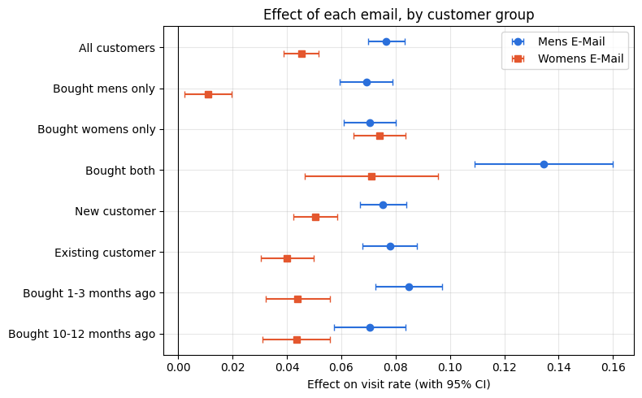
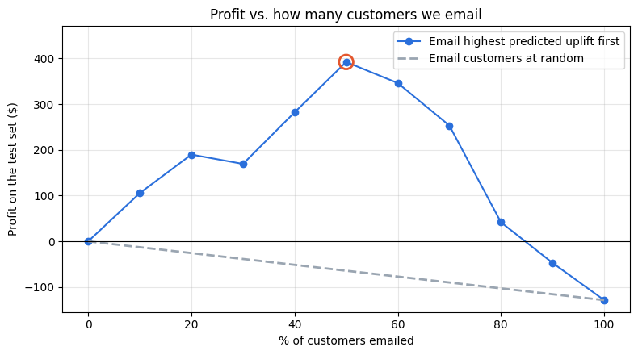

# Who Should We Email? From A/B Test to Targeting Policy

Causal inference and uplift modeling on a real randomized experiment: the **Hillstrom email dataset**, 64,000 customers randomly assigned to a men's-merchandise email, a women's-merchandise email, or no email.

The project walks from "did the email work?" to "which customers should get it?" — the same path a marketing analytics or experimentation team follows in production.



## Key finding

The men's email lifts visits for nearly every customer group — there's little to gain by targeting it. The women's email is very different: it works well on customers who already buy women's merchandise (~7 points) and does almost nothing for customers who have only bought men's merchandise (~1 point). That gap is what makes the women's email worth targeting, and the second half of the project builds and evaluates a model that does it.



Targeting the top 50% of customers by predicted uplift captures about 90% of the incremental visits from the women's email while sending half as many emails — turning a money-losing broadcast send into a profitable, targeted one under the notebook's stated cost assumptions.

## What's in this project

| Step | Technique | Why it matters |
|---|---|---|
| Sanity checks | Sample-ratio mismatch test, covariate balance (SMD) | The first thing any real experimentation platform checks before trusting a result |
| Average effect | Difference in means with confidence intervals, OLS regression cross-check | The headline number |
| Precision | CUPED variance reduction | Tighter confidence intervals from the same data — and an honest look at when it doesn't help |
| Heterogeneous effects | S-learner, T-learner, causal forest (EconML) | Moves from "does it work on average?" to "who does it work for?" |
| Model evaluation | Uplift by decile, Qini curves and Qini scores on a held-out test set | How to validate a model whose target (individual treatment effect) is never directly observed |
| Business decision | A profit curve with adjustable cost assumptions | Turns a model's ranking into a dollar-denominated targeting policy |

## Notebooks

- **`hillstrom_uplift.ipynb`** — the main walkthrough. Plain-English explanations before the math, explicit step-by-step code (no comprehensions or one-liners), and every result checked against a plot or a second calculation.
- **`hillstrom_uplift_advanced.ipynb`** — a denser version for a technical audience: adds Lin (2013) regression adjustment, the X-learner, stability checks across five random train/test splits, and a bootstrap uncertainty band on the profit curve.

Start with the main notebook if you're learning uplift modeling; read the advanced one for the fuller toolkit.

## Setup

```bash
git clone <this-repo-url>
cd hillstrom-uplift
pip install -r requirements.txt
```

Then get the data — see [`data/README.md`](data/README.md) for the one-line download, or let the notebook fetch it automatically via `scikit-uplift`.

```bash
jupyter notebook hillstrom_uplift.ipynb
```

## Repository structure

```
.
├── hillstrom_uplift.ipynb            # main notebook
├── hillstrom_uplift_advanced.ipynb   # denser / technical notebook
├── requirements.txt
├── data/
│   └── README.md                     # how to get hillstrom.csv (not committed)
├── docs/
│   └── images/                       # charts used in this README
└── LICENSE
```

## Methods used

- Randomization checks: chi-square sample-ratio-mismatch test, standardized mean differences (SMD)
- Average treatment effect: difference in means with robust (HC1) standard errors; OLS cross-check
- Variance reduction: CUPED (Deng, Xu, Kohavi & Walker, 2013); Lin (2013) regression adjustment (advanced notebook)
- Heterogeneous treatment effects: S-learner, T-learner, X-learner (advanced notebook), causal forest via `econml.dml.CausalForestDML` (Wager & Athey, 2018)
- Model evaluation: uplift-by-decile analysis, Qini curves, Qini AUC (`scikit-uplift`)
- Decision-making: a profit curve with bootstrap uncertainty (advanced notebook) and cost-sensitivity analysis

## Data source

Kevin Hillstrom, *The MineThatData E-Mail Analytics and Data Mining Challenge* (2008). The dataset is not redistributed in this repository — see [`data/README.md`](data/README.md).

## References

- Deng, A., Xu, Y., Kohavi, R., & Walker, T. (2013). Improving the sensitivity of online controlled experiments by utilizing pre-experiment data. *WSDM.*
- Lin, W. (2013). Agnostic notes on regression adjustments to experimental data. *Annals of Applied Statistics.*
- Künzel, S., Sekhon, J., Bickel, P., & Yu, B. (2019). Metalearners for estimating heterogeneous treatment effects using machine learning. *PNAS.*
- Wager, S., & Athey, S. (2018). Estimation and inference of heterogeneous treatment effects using random forests. *JASA.*
- Radcliffe, N. (2007). Using control groups to target on predicted lift. *Direct Marketing Analytics Journal.*

## License

Code in this repository is released under the [MIT License](LICENSE). The dataset itself is subject to its original publisher's terms — see `data/README.md`.
